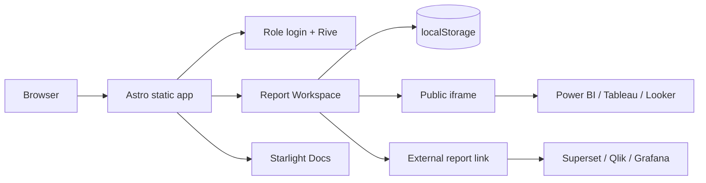

# Report Workspace

[](https://www.linkedin.com/in/drphp/)
[](https://www.linkedin.com/in/drphp/)

<a href="https://www.instagram.com/amvsoft.tech/">
  
</a>

Portal estatico para centralizar, administrar y visualizar reportes de distintas plataformas BI. Esta construido con Astro, usa Starlight para la documentación y Rive para la experiencia interactiva de acceso.

El repositorio contiene dos productos en una misma aplicacion:

| Area | Ruta | Proposito |
| --- | --- | --- |
| Visor de Reportes | `/` | Login por rol, catalogo, administracion y visualizacion de reportes |
| PHPeitor Docs | `/docs/` | Documentacion tecnica y funcional basada en Starlight |

## Stack

| Tecnologia | Uso |
| --- | --- |
| [Astro 5](https://astro.build/) | Renderizado estatico, componentes y bundling |
| [Starlight](https://starlight.astro.build/) | Experiencia de documentacion |
| [Rive Canvas](https://rive.app/docs/runtimes/web/) | Animacion interactiva del login |
| TypeScript | Modelo de datos y validacion estatica |
| CSS nativo | Sistema visual, temas y responsive design |

## Funcionalidad

- Login de demostracion con permisos por rol.
- Navegacion por modulo y reporte.
- Alta, edicion, activacion y desactivacion de reportes.
- Deteccion automatica de plataforma a partir de la URL.
- Visualizacion por iframe cuando el proveedor permite embedding.
- Fallback a enlace externo cuando el proveedor bloquea iframes.
- Temas claro y oscuro persistidos en el navegador.
- Sidebar responsive, colapsable y accesible.
- Tabla administrativa paginada con estados semanticos.
- Login Rive conectado a hover, foco, tema y eventos de la animacion.
- Documentacion Starlight con busqueda, partners y footer personalizado.

## Inicio rápido

### Requisitos

- Node.js 20 LTS o superior recomendado.
- npm 10 o superior.

### Instalación

```bash
npm install
npm run dev
```

La aplicacion queda disponible en `http://localhost:4321`.

No inicies una segunda instancia si el puerto `4321` ya esta ocupado. Astro intentara usar otro puerto y podrias terminar revisando una version distinta de la aplicacion.

### Validación

```bash
npm run validate
```

Este comando ejecuta el diagnostico de Astro/TypeScript y luego genera el build de produccion.

## Scripts

| Comando | Descripcion |
| --- | --- |
| `npm run dev` | Inicia el servidor de desarrollo con HMR |
| `npm run check` | Ejecuta `astro check` |
| `npm run build` | Genera el sitio estatico en `dist/` |
| `npm run preview` | Sirve localmente el build generado |
| `npm run validate` | Ejecuta check y build en secuencia |

## Usuarios de demostración

La autenticacion actual es una simulacion frontend sin contrasena. Los usuarios se definen en `src/data/initialReports.ts`.

| Usuario | Rol | Alcance |
| --- | --- | --- |
| `php.io` | Admin | Administra y visualiza todos los reportes |
| `operaciones` | Operaciones | Visualiza reportes activos de Operaciones |
| `finanzas` | Finanzas | Visualiza reportes activos de Finanzas |
| `comercial` | Comercial | Visualiza reportes activos de Comercial |

> Este mecanismo no es autenticacion productiva. No almacena contrasenas, no crea una sesion de servidor y no debe usarse para proteger informacion privada.

## Arquitectura



### Estructura principal

```text
src/
|-- components/
|   |-- DocsFooter.astro
|   |-- PartnersSidebar.astro
|   |-- ReportForm.astro
|   |-- ReportViewer.astro
|   `-- Sidebar.astro
|-- content/
|   |-- config.ts
|   `-- docs/
|       |-- astro.riv
|       |-- favicon.svg
|       |-- phpeitor-docs.svg
|       `-- reniec.md
|-- data/
|   `-- initialReports.ts
|-- layouts/
|   `-- DashboardLayout.astro
|-- pages/
|   |-- docs/index.astro
|   `-- index.astro
`-- styles/
    |-- global.css
    `-- starlight.css
```

### Responsabilidades

| Archivo | Responsabilidad |
| --- | --- |
| `src/pages/index.astro` | Estado del cliente, permisos, persistencia, render de catalogo y eventos |
| `src/data/initialReports.ts` | Tipos, usuarios demo y catalogo inicial |
| `src/components/Sidebar.astro` | Marca, navegacion y sesion activa |
| `src/components/ReportForm.astro` | Registro de reportes |
| `src/components/ReportViewer.astro` | Iframe y fallback de apertura externa |
| `src/styles/global.css` | Sistema visual del workspace y login |
| `src/pages/docs/index.astro` | Contenido y navegacion de la documentacion |
| `astro.config.mjs` | Starlight, favicon, componentes personalizados y servidor |

## Modelo de datos

### ReportItem

```ts
interface ReportItem {
  id: string;
  name: string;
  module: string;
  url: string;
  platform: BiPlatform;
  strategy: EmbedStrategy;
  status: 0 | 1;
}
```

Plataformas soportadas:

```ts
type BiPlatform =
  | 'powerbi'
  | 'tableau'
  | 'superset'
  | 'qlik'
  | 'grafana'
  | 'looker'
  | 'other';
```

Estrategias de visualizacion:

```ts
type EmbedStrategy =
  | 'iframe-public'
  | 'external-link'
  | 'official-sdk'
  | 'secure-token';
```

`status` permanece como `0 | 1` en almacenamiento, pero la interfaz muestra `Inactivo` o `Activo`.

## Plataformas y embedding

| Plataforma | Estrategia demo | Consideracion |
| --- | --- | --- |
| Power BI | `iframe-public` | Requiere un enlace Publish to web valido |
| Tableau Public | `iframe-public` | Usa una vista publica con `showVizHome=no` |
| Looker Studio | `iframe-public` | Debe utilizar la URL `/embed/reporting/...` |
| Apache Superset | `external-link` | La instancia demo usa `X-Frame-Options: SAMEORIGIN` |
| Qlik Sense | `external-link` | La galeria publica bloquea framing cross-origin |
| Grafana | `external-link` | Grafana Play declara `frame-ancestors 'none'` |

Los reportes publicos son recursos de terceros y pueden cambiar, expirar o modificar sus politicas de embedding sin previo aviso.

## Persistencia local

La aplicacion es frontend-only y usa estas claves:

| Clave | Contenido |
| --- | --- |
| `bi-reports-v2` | Catalogo de reportes y cambios administrativos |
| `bi-auth-v1` | Usuario y rol activos |
| `bi-theme-v1` | Tema claro u oscuro |

`src/data/initialReports.ts` solo es la semilla inicial. La UI no modifica ese archivo; guarda los cambios en `localStorage`.

Para restaurar los datos iniciales:

```js
localStorage.removeItem('bi-reports-v2');
location.reload();
```

## Integración Rive

El login carga `src/content/docs/astro.riv` con `@rive-app/canvas`.

Configuracion esperada del archivo:

| Recurso | Nombre |
| --- | --- |
| Artboard | `Astronaut` |
| State machine | `State Machine` |

La UI conecta inputs del state machine con hover, foco, cambio de tema y controles del formulario. Los eventos emitidos por Rive actualizan el indicador de estado del login.

El runtime marca algunos metodos de State Machine como legacy. Actualmente son necesarios para este archivo `.riv`; una migracion futura debe mover la animacion a View Model/Data Binding.

## Documentación Starlight

La documentacion vive en `/docs/` e incluye:

- Navegacion lateral con scroll independiente.
- Busqueda con Pagefind.
- Columna de partners personalizada.
- Footer full-width con SVG animado.
- Documentacion funcional del dataset RENIEC.

No publiques credenciales, tokens de embedding ni datos personales dentro del contenido de Starlight.

## Build y despliegue

```bash
npm run validate
```

El resultado se genera en `dist/` y puede servirse desde Apache, Nginx, un bucket estatico o una plataforma compatible con sitios estaticos.

Ejemplo para Apache:

```apache
DocumentRoot "C:/Apache24/htdocs/astro-reports/dist"
DirectoryIndex index.html
```

La integración de sitemap requiere configurar `site` en `astro.config.mjs`. Mientras no exista una URL publica definitiva, Astro omitira el sitemap y mostrara un warning durante el build.

## Seguridad y paso a producción

Antes de usar el proyecto con reportes privados:

1. Sustituir el login demo por autenticacion de servidor.
2. Mover permisos y filtrado de reportes al backend.
3. Persistir el catalogo en una base de datos.
4. Emitir tokens de corta duracion para Power BI, Tableau o Superset.
5. Validar y permitir solo dominios de embedding autorizados.
6. Agregar CSP, auditoria, expiracion de sesion y proteccion CSRF.
7. Evitar `Publish to web` para informacion interna o sensible.

## Solución de problemas

### El puerto 4321 esta ocupado

Ya existe un servidor Astro activo. Cierra la instancia anterior antes de ejecutar nuevamente `npm run dev`.

### No aparecen los reportes nuevos de la semilla

El catalogo persistido tiene prioridad. Elimina `bi-reports-v2` desde DevTools y recarga.

### Un reporte no aparece en iframe

Revisa `X-Frame-Options` y `Content-Security-Policy`. Si el proveedor bloquea framing, usa `external-link` o su SDK oficial.

### El login no muestra la animación

Comprueba que `astro.riv` exista, que el artboard/state machine mantengan sus nombres y que el canvas no tenga errores en consola.

## Criterio de calidad

Antes de entregar cambios:

```bash
npm run validate
```

El proyecto debe completar `astro check` sin errores y generar correctamente todas las rutas estaticas.
