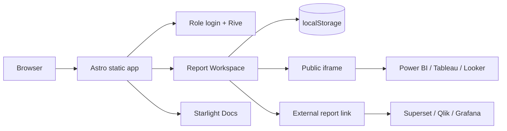

# Report Workspace 👨‍🚀

[](https://www.linkedin.com/in/drphp/)

<a href="https://www.instagram.com/amvsoft.tech/">
  
</a>

El repositorio contiene dos productos en una misma aplicación:

| Área | Ruta | Propósito |
| --- | --- | --- |
| Visor de Reportes | `/` | Login por rol, catálogo, administración y visualización de reportes |
| Docs | `/docs/` | Documentación técnica y funcional basada en Starlight |

## Stack

| Tecnología | Uso |
| --- | --- |
| [Astro 5](https://astro.build/) | Renderizado estático, componentes y bundling |
| [Starlight](https://starlight.astro.build/) | Experiencia de documentación |
| [Rive Canvas](https://rive.app/docs/runtimes/web/) | Animación interactiva del login |
| TypeScript | Modelo de datos y validación estática |
| CSS nativo | Sistema visual, temas y responsive design |

## Funcionalidad

- Login de demostración con permisos por rol.
- Navegación por módulo y reporte.
- Alta, edición, activación y desactivación de reportes.
- Detección automática de plataforma a partir de la URL.
- Visualización por iframe cuando el proveedor permite embedding.
- Fallback a enlace externo cuando el proveedor bloquea iframes.
- Temas claro y oscuro persistidos en el navegador.
- Sidebar responsive, colapsable y accesible.
- Tabla administrativa paginada con estados semánticos.
- Login Rive conectado a hover, foco, tema y eventos de la animación.
- Documentación Starlight con búsqueda, partners y footer personalizado.

## Inicio rápido

### Requisitos

- Node.js 20 LTS o superior recomendado.
- npm 10 o superior.

### Instalación

```bash
npm install
npm run dev
```

La aplicación queda disponible en `http://localhost:4321`.

No inicies una segunda instancia si el puerto `4321` ya está ocupado. Astro intentará usar otro puerto y podrías terminar revisando una versión distinta de la aplicación.

### Validación

```bash
npm run validate
```

Este comando ejecuta el diagnóstico de Astro/TypeScript y luego genera el build de producción.

## Scripts

| Comando | Descripción |
| --- | --- |
| `npm run dev` | Inicia el servidor de desarrollo con HMR |
| `npm run check` | Ejecuta `astro check` |
| `npm run build` | Genera el sitio estático en `dist/` |
| `npm run preview` | Sirve localmente el build generado |
| `npm run validate` | Ejecuta check y build en secuencia |

## Usuarios de demostración

La autenticación actual es una simulación frontend sin contraseña. Los usuarios se definen en `src/data/initialReports.ts`.

| Usuario | Rol | Alcance |
| --- | --- | --- |
| `php.io` | Admin | Administra y visualiza todos los reportes |
| `operaciones` | Operaciones | Visualiza reportes activos de Operaciones |
| `finanzas` | Finanzas | Visualiza reportes activos de Finanzas |
| `comercial` | Comercial | Visualiza reportes activos de Comercial |

> Este mecanismo no es autenticación productiva. No almacena contraseñas, no crea una sesión de servidor y no debe usarse para proteger información privada.

## Arquitectura



### Estructura principal

```text
src/
|-- components/
|   |-- DocsFooter.astro
|   |-- PartnersSidebar.astro
|   |-- ReportForm.astro
|   |-- ReportViewer.astro
|   `-- Sidebar.astro
|-- content/
|   |-- config.ts
|   `-- docs/
|       |-- astro.riv
|       |-- favicon.svg
|       |-- phpeitor-docs.svg
|       `-- reniec.md
|-- data/
|   `-- initialReports.ts
|-- layouts/
|   `-- DashboardLayout.astro
|-- pages/
|   |-- docs/index.astro
|   `-- index.astro
`-- styles/
    |-- global.css
    `-- starlight.css
```

### Responsabilidades

| Archivo | Responsabilidad |
| --- | --- |
| `src/pages/index.astro` | Estado del cliente, permisos, persistencia, render de catálogo y eventos |
| `src/data/initialReports.ts` | Tipos, usuarios demo y catálogo inicial |
| `src/components/Sidebar.astro` | Marca, navegación y sesión activa |
| `src/components/ReportForm.astro` | Registro de reportes |
| `src/components/ReportViewer.astro` | Iframe y fallback de apertura externa |
| `src/styles/global.css` | Sistema visual del workspace y login |
| `src/pages/docs/index.astro` | Contenido y navegación de la documentación |
| `astro.config.mjs` | Starlight, favicon, componentes personalizados y servidor |

## Modelo de datos

### ReportItem

```ts
interface ReportItem {
  id: string;
  name: string;
  module: string;
  url: string;
  platform: BiPlatform;
  strategy: EmbedStrategy;
  status: 0 | 1;
}
```

Plataformas soportadas:

```ts
type BiPlatform =
  | 'powerbi'
  | 'tableau'
  | 'superset'
  | 'qlik'
  | 'grafana'
  | 'looker'
  | 'other';
```

Estrategias de visualización:

```ts
type EmbedStrategy =
  | 'iframe-public'
  | 'external-link'
  | 'official-sdk'
  | 'secure-token';
```

`status` permanece como `0 | 1` en almacenamiento, pero la interfaz muestra `Inactivo` o `Activo`.

## Plataformas y embedding

| Plataforma | Estrategia demo | Consideración |
| --- | --- | --- |
| Power BI | `iframe-public` | Requiere un enlace Publish to web válido |
| Tableau Public | `iframe-public` | Usa una vista pública con `showVizHome=no` |
| Looker Studio | `iframe-public` | Debe utilizar la URL `/embed/reporting/...` |
| Apache Superset | `external-link` | La instancia demo usa `X-Frame-Options: SAMEORIGIN` |
| Qlik Sense | `external-link` | La galería pública bloquea framing cross-origin |
| Grafana | `external-link` | Grafana Play declara `frame-ancestors 'none'` |

Los reportes públicos son recursos de terceros y pueden cambiar, expirar o modificar sus políticas de embedding sin previo aviso.

## Persistencia local

La aplicación es solo frontend y usa estas claves:

| Clave | Contenido |
| --- | --- |
| `bi-reports-v2` | Catálogo de reportes y cambios administrativos |
| `bi-auth-v1` | Usuario y rol activos |
| `bi-theme-v1` | Tema claro u oscuro |

`src/data/initialReports.ts` solo es la semilla inicial. La UI no modifica ese archivo; guarda los cambios en `localStorage`.

Para restaurar los datos iniciales:

```js
localStorage.removeItem('bi-reports-v2');
location.reload();
```

## Integración Rive

El login carga `src/content/docs/astro.riv` con `@rive-app/canvas`.

Configuración esperada del archivo:

| Recurso | Nombre |
| --- | --- |
| Artboard | `Astronaut` |
| State machine | `State Machine` |

La UI conecta inputs del state machine con hover, foco, cambio de tema y controles del formulario. Los eventos emitidos por Rive actualizan el indicador de estado del login.

El runtime marca algunos métodos de State Machine como legacy. Actualmente son necesarios para este archivo `.riv`; una migración futura debe mover la animación a View Model/Data Binding.

## Documentación Starlight

La documentación vive en `/docs/` e incluye:

- Navegación lateral con scroll independiente.
- Búsqueda con Pagefind.
- Columna de partners personalizada.
- Footer full-width con SVG animado.
- Documentación funcional del dataset RENIEC.

No publiques credenciales, tokens de embedding ni datos personales dentro del contenido de Starlight.

## Build y despliegue

```bash
npm run validate
```

El resultado se genera en `dist/` y puede servirse desde Apache, Nginx, un bucket estático o una plataforma compatible con sitios estáticos.

Ejemplo para Apache:

```apache
DocumentRoot "C:/Apache24/htdocs/astro-reports/dist"
DirectoryIndex index.html
```

La integración de sitemap requiere configurar `site` en `astro.config.mjs`. Mientras no exista una URL pública definitiva, Astro omitirá el sitemap y mostrará un warning durante el build.

## Seguridad y paso a producción

Antes de usar el proyecto con reportes privados:

1. Sustituir el login demo por autenticación de servidor.
2. Mover permisos y filtrado de reportes al backend.
3. Persistir el catálogo en una base de datos.
4. Emitir tokens de corta duración para Power BI, Tableau o Superset.
5. Validar y permitir solo dominios de embedding autorizados.
6. Agregar CSP, auditoría, expiración de sesión y protección CSRF.
7. Evitar `Publish to web` para información interna o sensible.

## Solución de problemas

### El puerto 4321 está ocupado

Ya existe un servidor Astro activo. Cierra la instancia anterior antes de ejecutar nuevamente `npm run dev`.

### No aparecen los reportes nuevos de la semilla

El catálogo persistido tiene prioridad. Elimina `bi-reports-v2` desde DevTools y recarga.

### Un reporte no aparece en iframe

Revisa `X-Frame-Options` y `Content-Security-Policy`. Si el proveedor bloquea framing, usa `external-link` o su SDK oficial.

### El login no muestra la animación

Comprueba que `astro.riv` exista, que el artboard/state machine mantengan sus nombres y que el canvas no tenga errores en consola.

## Criterio de calidad

Antes de entregar cambios:

```bash
npm run validate
```

El proyecto debe completar `astro check` sin errores y generar correctamente todas las rutas estáticas.
